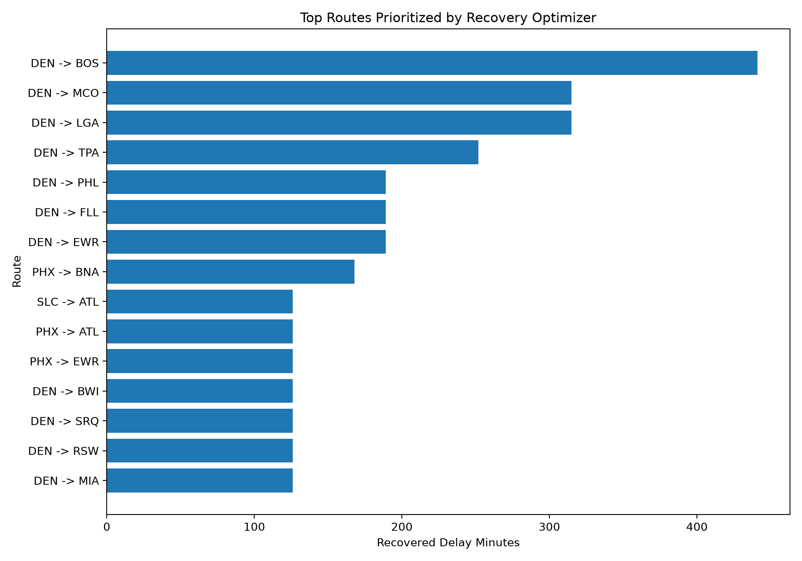

# Airline Disruption Recovery Optimizer: A Learning-Augmented Optimization Framework for Airline Network Recovery

## Abstract

Airline operations are highly sensitive to disruptions caused by weather, airport congestion, aircraft delays, and network dependencies. A delay at one airport can propagate across routes, affect downstream flights, increase passenger inconvenience, and create system-wide operational instability.

This project develops an end-to-end research prototype that combines machine learning, network analysis, disruption simulation, and mathematical optimization to support airline disruption recovery decisions. Using U.S. airline on-time performance data from January 2025, the system cleans and analyzes flight-level data, predicts arrival delay risk, identifies high-risk airports and routes, simulates airport disruption scenarios, and optimizes recovery actions under limited operational capacity.

The project demonstrates a decision-support pipeline that moves beyond prediction toward actionable optimization, making it relevant to Operations Research, Industrial Engineering, transportation systems, and PhD-level research in decision-making under uncertainty.

---

## 1. Research Motivation

Airline disruption recovery is a complex operational decision problem. When a major airport experiences weather, congestion, aircraft delay, or capacity reduction, airlines must quickly decide how to recover their schedule.

These decisions are difficult because airline networks are interconnected. A delayed flight can affect aircraft rotations, downstream departures, passenger connections, gate usage, crew schedules, and route-level service reliability.

Traditional delay prediction models can estimate whether a flight is likely to be delayed, but prediction alone does not answer the operational question:

> What should the airline do next?

This project addresses that gap by combining predictive analytics with optimization. The central research question is:

> How can machine learning, network analysis, simulation, and optimization be integrated to improve airline disruption recovery decisions under network uncertainty?

---

## 2. Dataset

The project currently uses BTS U.S. airline on-time performance data for January 2025.

The processed dataset contains:

* 539,747 flights
* 34 cleaned columns
* Flight date
* Carrier
* Origin and destination airports
* Scheduled departure and arrival times
* Actual departure and arrival delay metrics
* Cancellation and diversion indicators
* Distance
* Engineered delay labels

Key dataset statistics:

* Arrival delay rate, 15+ minutes: 18.18%
* Arrival delay rate, 60+ minutes: 6.16%
* Cancellation rate: 3.02%
* Diversion rate: 0.22%

Raw and processed data are excluded from GitHub to keep the repository lightweight.

---

## 3. Methodology Overview

The project follows a full data-to-decision pipeline:

```text
Raw BTS Airline Data
        |
        v
Data Cleaning Pipeline
        |
        v
Exploratory Delay Analysis
        |
        v
Delay Prediction Model
        |
        v
Airport and Route Network Analysis
        |
        v
Disruption Simulation Engine
        |
        v
Recovery Optimization Model
        |
        v
Streamlit Decision Dashboard
```

This structure is designed to show how airline operations can be studied not only as a prediction problem, but also as a decision optimization problem.

---

## 4. Data Cleaning Pipeline

The data cleaning module reads BTS airline on-time performance data from raw CSV or ZIP files and converts it into a structured Parquet dataset.

The pipeline standardizes column names, handles duplicate BTS fields, converts dates and numeric fields, and engineers target variables for delay prediction.

Engineered labels include:

* `arrival_delay_15`: whether a flight arrived 15 or more minutes late
* `arrival_delay_60`: whether a flight arrived 60 or more minutes late
* `departure_delay_15`: whether a flight departed 15 or more minutes late

The cleaned dataset becomes the foundation for exploratory analysis, modeling, network analysis, simulation, and optimization.

---

## 5. Exploratory Delay Analysis

The exploratory analysis identifies delay and cancellation patterns by carrier, airport, route, and day of week.

The analysis produces:

* Arrival delay distribution
* Carrier-level delay rates
* Airport-level delay rates
* Route-level delay risk
* Day-of-week delay patterns

The results show that delay risk is not evenly distributed across the airline system. Some carriers and airports experience higher delay rates, while specific routes show elevated risk due to both delay frequency and operational volume.

This analysis provides the foundation for later network modeling and disruption simulation.

---

## 6. Baseline Delay Prediction Model

A baseline machine learning model was developed to predict whether a flight will arrive 15 or more minutes late.

The target variable is:

```text
arrival_delay_15
```

The model uses only pre-departure schedule information, including:

* Carrier
* Origin airport
* Destination airport
* Scheduled departure hour
* Scheduled arrival hour
* Day of week
* Month
* Distance
* Scheduled elapsed time

The model intentionally avoids using actual departure delay, arrival delay, or delay-cause variables because those would introduce data leakage. This makes the model more realistic as a pre-flight decision-support tool.

The baseline model provides an initial delay-risk estimate that can later be improved with additional features such as weather, airport congestion, inbound aircraft delay, and network pressure.

---

## 7. Airline Network Risk Analysis

The project converts flight records into a directed airport-route network.

In this network:

* Nodes represent airports
* Directed edges represent origin-destination routes
* Edge weights represent flight volume, delay rates, cancellation rates, and route delay risk

The network analysis computes:

* Weighted in-degree and out-degree
* Route degree
* PageRank
* Betweenness centrality
* Network criticality score
* Airport disruption risk score
* Route delay risk score

This step is important because an airport may not be risky only because it has high delays. It may also be risky because it is structurally important to the network. A disruption at a high-centrality airport can create larger downstream effects than a similar disruption at a less connected airport.

The network analysis therefore helps identify airports and routes that are important candidates for disruption simulation and recovery optimization.

---

## 8. Disruption Simulation Engine

The disruption simulator estimates the impact of an airport-level disruption.

A typical scenario asks:

> What happens if a major airport experiences a disruption during a selected time window?

The simulator models two types of impact.

First, primary disruption impact occurs when flights departing from the disrupted airport during the selected time window receive additional delay.

Second, downstream propagation impact occurs when destination airports receiving delayed inbound flights experience additional operational pressure, which can affect later outbound flights.

The simulator outputs:

* Primary impacted flights
* Downstream impacted flights
* Total impacted flights
* Added delay minutes
* Average delay increase per impacted flight
* Top affected airports
* Top affected routes

This provides a controlled experimental environment for testing recovery strategies.

---

## 9. Recovery Optimization Model

The recovery optimizer is the first formal Operations Research component of the project.

It reads the disruption simulation output and selects a limited number of disrupted flights to prioritize for recovery.

The objective is:

```text
Maximize recovered delay minutes
```

The model includes constraints such as:

* Maximum number of recovery actions
* Maximum primary disruption recovery actions
* Maximum downstream recovery actions
* Carrier concentration limit
* Airport concentration limit

The optimization model uses binary decision variables where each candidate flight is either selected or not selected for recovery.

This allows the project to move from descriptive analysis to prescriptive decision-making. Instead of only identifying which flights are delayed, the optimizer recommends which flights should receive scarce recovery resources.

---

## Selected Visual Outputs

### 1. Arrival Delay Distribution

This chart shows the distribution of arrival delay minutes across the January 2025 flight dataset. It highlights the long-tail nature of airline delays, where most flights are near on-time but a smaller group experiences significant delays.


---

### 2. Carrier Delay Rate

This visualization compares the percentage of flights arriving 15 or more minutes late across carriers. It helps identify which carriers experienced higher delay rates during the study period.


---

### 3. Airport Disruption Risk Score

This chart ranks airports using a disruption-risk score that combines delay performance, cancellation risk, and network importance. This is one of the most important visuals for the Operations Research angle of the project.


---

### 4. Airline Route Network

This network graph represents airports as nodes and routes as directed edges. It shows how airline operations form an interconnected transportation network where disruptions can propagate from one airport to another.


---

### 5. Simulated Disruption vs Optimized Recovery

This chart compares total positive delay under the simulated disruption scenario versus the optimized recovery plan. It demonstrates the value of moving from prediction to optimization.


---

### 6. Top Optimized Recovery Routes

This chart shows the routes prioritized by the recovery optimizer. These are the routes where recovery actions produce the largest delay-reduction benefit under limited operational capacity.



---
## 10. Dashboard

The Streamlit dashboard connects the full project into an interactive decision-support system.

Dashboard pages include:

* Overview
* Exploratory Delay Analysis
* Delay Model
* Network Analysis
* Disruption Simulator
* Recovery Optimizer
* PhD Research Summary

The dashboard allows a user to inspect airline delay patterns, review model results, explore network risk, run disruption simulations, and test optimization scenarios.

This makes the project useful not only as a research prototype, but also as a portfolio-ready application.

---

## 11. Research Contribution

The project’s main contribution is the integration of prediction, network analysis, simulation, and optimization into one end-to-end airline recovery framework.

The project demonstrates the following capabilities:

* Cleaning and structuring large-scale transportation data
* Building leakage-aware predictive models
* Modeling airline operations as a network
* Simulating disruption propagation
* Formulating a constrained recovery optimization problem
* Presenting results through an interactive decision dashboard

This combination is directly aligned with Operations Research and Industrial Engineering research, especially in transportation systems, stochastic systems, and decision-making under uncertainty.

---

## 12. Limitations

This version is an MVP research prototype. It does not yet include:

* Real aircraft rotations
* Crew legality constraints
* Gate availability
* Passenger itineraries
* Missed connection modeling
* Weather data integration
* Real-time airport capacity data
* Multi-day schedule recovery
* Full stochastic or robust optimization

The current simulator uses simplified propagation logic. The recovery optimizer prioritizes flights based on delay recovery potential and fairness constraints, but does not yet model all real airline operational constraints.

---

## 13. Future Research Extensions

Future versions can extend this project in several PhD-relevant directions.

### Weather-Aware Delay Prediction

Integrate weather variables such as precipitation, wind speed, visibility, storm intensity, and airport weather alerts to improve delay prediction.

### Aircraft Rotation Recovery

Use tail numbers and scheduled sequences to model aircraft rotations and optimize recovery decisions across connected flight legs.

### Passenger Reaccommodation Optimization

Incorporate passenger flows, missed connections, and itinerary-level disruption cost.

### Robust Optimization

Develop recovery plans that remain effective under uncertain delay duration, airport capacity, or weather forecasts.

### Stochastic Programming

Model multiple disruption scenarios and optimize recovery strategies under probabilistic uncertainty.

### Fairness-Aware Recovery

Study how recovery decisions affect different carriers, airports, and passenger groups, and introduce fairness constraints into the optimization model.

### Multi-Airport Disruption Simulation

Extend the simulator to handle multiple simultaneous disruptions, such as weather events affecting several airports in the same region.

---

## 14. PhD Research Positioning

This project supports a broader research direction in:

**Learning-Augmented Optimization for Large-Scale Transportation Systems**

A possible PhD research statement based on this project is:

> My research interest lies in developing learning-augmented optimization methods for transportation systems under uncertainty. Using airline disruption recovery as an application area, I aim to study how predictive models, network analytics, and robust optimization can be integrated to support real-time operational decision-making. This project demonstrates my initial work toward building decision-support systems that move beyond prediction and toward optimized recovery actions in complex, interconnected networks.

---

## 15. Conclusion

This project shows how airline disruption recovery can be studied as a full decision pipeline rather than a standalone prediction task. By combining machine learning, network analysis, simulation, and optimization, the system provides a foundation for future research in airline operations, transportation analytics, and Operations Research.

The current version establishes an end-to-end MVP. Future work can make the system more realistic by incorporating weather, aircraft rotations, passenger itineraries, robust optimization, and stochastic disruption scenarios.
