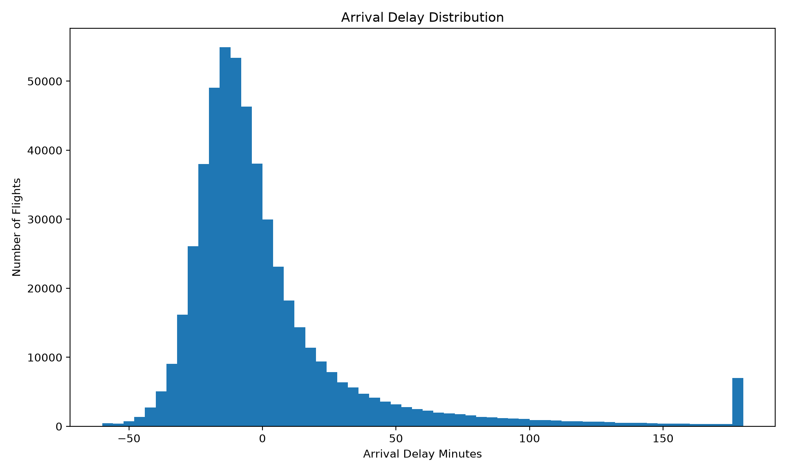
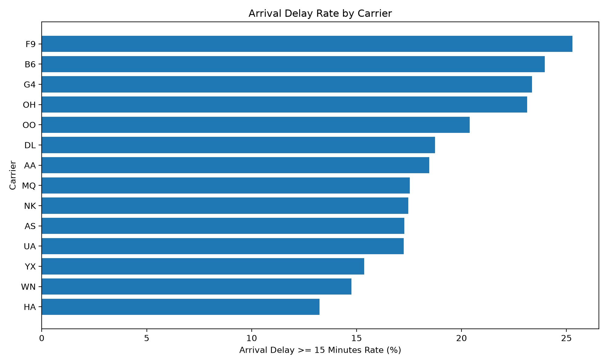
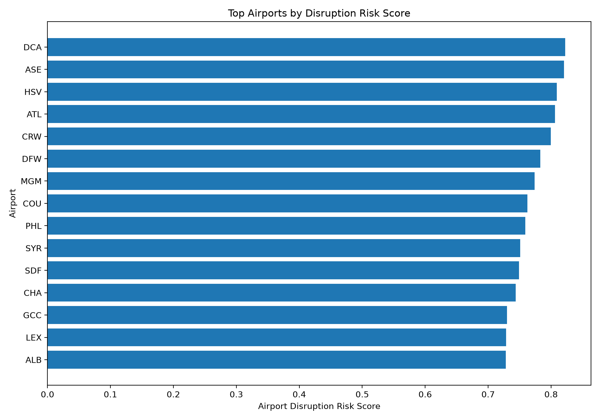
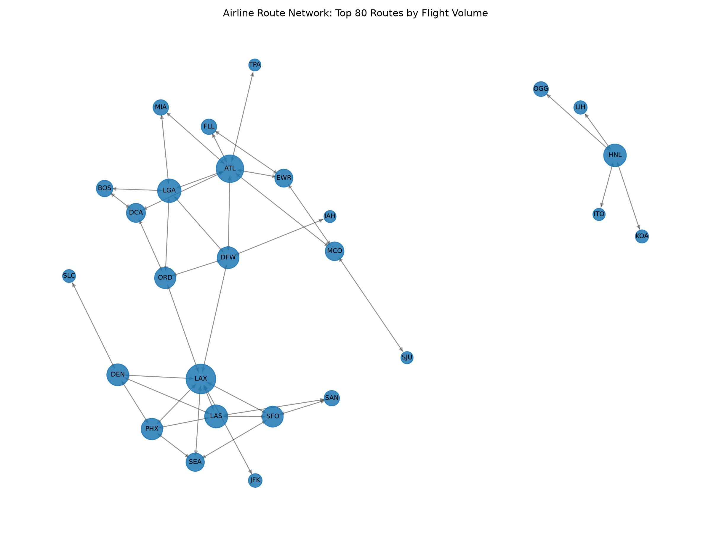
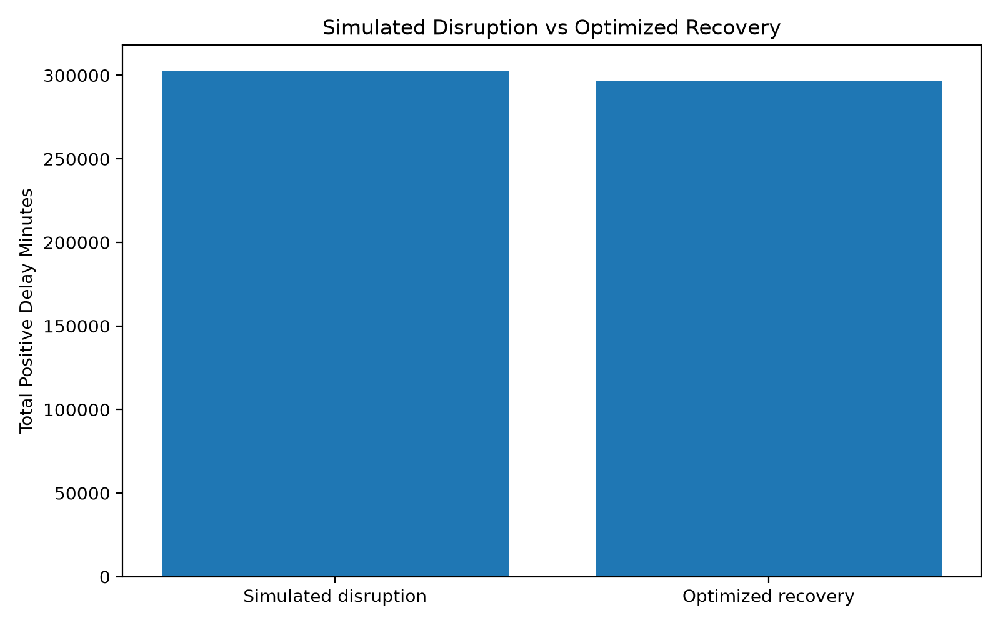

# Airline Disruption Recovery Optimizer

An end-to-end machine learning and operations research project for airline disruption recovery.

This project predicts flight delay risk, analyzes airport-route network fragility, simulates disruption propagation, and optimizes recovery actions under limited operational capacity.

---

## Research Theme

**Learning-Augmented Optimization for Airline Disruption Recovery Under Network Uncertainty**

This project is designed for a portfolio and PhD research direction in:

* Operations Research
* Industrial Engineering
* Transportation Analytics
* Network Optimization
* Decision-Making Under Uncertainty

---

## Project Objective

Airline networks are highly interconnected. A disruption at one airport can delay flights, affect downstream routes, increase passenger disruption, and create network-wide instability.

This project asks:

> How can machine learning, network analysis, simulation, and optimization be combined to improve airline disruption recovery decisions?

---

## Current Dataset

The project currently uses BTS U.S. airline on-time performance data for January 2025.

Processed dataset summary:

* Flights analyzed: 539,747
* Arrival delay rate, 15+ minutes: 18.18%
* Arrival delay rate, 60+ minutes: 6.16%
* Cancellation rate: 3.02%
* Diversion rate: 0.22%

Raw and processed data files are excluded from GitHub.

---

## System Pipeline

```text
Raw BTS Airline Data
        |
        v
Data Cleaning Pipeline
        |
        v
Exploratory Delay Analysis
        |
        v
Delay Prediction Model
        |
        v
Airport and Route Network Analysis
        |
        v
Disruption Simulation Engine
        |
        v
Recovery Optimization Model
        |
        v
Streamlit Decision Dashboard
```

---

## Core Components

### 1. Data Cleaning Pipeline

Cleans BTS airline on-time performance data and creates a structured Parquet dataset.

```bash
python src/data/clean_bts_on_time.py
```

Output:

```text
data/processed/flights_clean.parquet
```

---

### 2. Exploratory Delay Analysis

Analyzes delay and cancellation patterns by carrier, airport, route, and day of week.

```bash
python src/visualization/eda_flights.py
```

Outputs:

```text
reports/eda_summary.md
figures/arrival_delay_distribution.png
figures/carrier_delay_rate.png
figures/top_origin_airports_by_delay_rate.png
figures/day_of_week_delay_rate.png
```

---

### 3. Baseline Delay Prediction Model

Predicts whether a flight will arrive 15+ minutes late using pre-departure schedule information.

```bash
python src/models/train_delay_model.py
```

Features include:

```text
carrier
origin airport
destination airport
scheduled departure hour
scheduled arrival hour
day of week
month
distance
scheduled elapsed time
```

Outputs:

```text
reports/delay_model_report.md
reports/delay_model_metrics.json
figures/delay_model_confusion_matrix.png
figures/delay_model_roc_curve.png
```

---

### 4. Airline Network Risk Analysis

Converts flights into a directed airport-route network.

* Nodes = airports
* Edges = origin-destination routes
* Edge weights = flight volume and delay risk

```bash
python src/network/analyze_airline_network.py
```

Network metrics include:

```text
weighted degree
route degree
PageRank
betweenness centrality
network criticality score
airport disruption risk score
route delay risk score
```

Outputs:

```text
reports/network_analysis_report.md
figures/airport_disruption_risk_score.png
figures/route_delay_risk_score.png
figures/airline_route_network_top_routes.png
```

---

### 5. Disruption Simulation Engine

Simulates an airport disruption and estimates direct plus downstream delay propagation.

```bash
python src/simulation/disruption_simulator.py --airport DEN
```

Custom scenario:

```bash
python src/simulation/disruption_simulator.py \
  --airport DEN \
  --start-hour 7 \
  --end-hour 16 \
  --primary-delay 120 \
  --propagation-window 8
```

Outputs:

```text
reports/disruption_simulation_report.md
reports/disruption_simulation_metrics.json
figures/disruption_impact_by_stage.png
figures/disruption_top_affected_airports.png
```

---

### 6. Recovery Optimization Model

Uses mathematical optimization to prioritize recovery actions under limited operational capacity.

```bash
python src/optimization/recovery_optimizer.py
```

Objective:

```text
Maximize recovered delay minutes
```

Constraints include:

```text
maximum recovery actions
primary disruption action limit
downstream recovery action limit
carrier concentration limit
airport concentration limit
```

Outputs:

```text
reports/recovery_optimization_report.md
reports/recovery_optimization_metrics.json
figures/optimized_vs_simulated_delay.png
figures/recovered_delay_by_stage.png
figures/top_optimized_recovery_routes.png
```

---

### 7. Streamlit Dashboard

Runs the full decision-support dashboard.

```bash
python -m streamlit run app.py
```

Dashboard pages:

```text
Overview
EDA
Delay Model
Network Analysis
Disruption Simulator
Recovery Optimizer
PhD Research Summary
```

---

## Selected Visual Outputs

### Arrival Delay Distribution



### Carrier Delay Rate



### Airport Disruption Risk



### Airline Route Network



### Simulated vs Optimized Delay



---

## Project Structure

```text
airline-disruption-optimizer/
│
├── app.py
├── README.md
├── requirements.txt
│
├── data/
│   ├── raw/
│   └── processed/
│
├── figures/
├── reports/
│
├── src/
│   ├── data/
│   ├── models/
│   ├── network/
│   ├── optimization/
│   ├── simulation/
│   └── visualization/
│
└── tests/
```

---

## Setup

Create and activate the environment:

```bash
uv python install 3.12
uv venv .venv --python 3.12
source .venv/bin/activate
```

Install dependencies:

```bash
uv pip install -r requirements.txt
```

Run the full pipeline:

```bash
python src/data/clean_bts_on_time.py
python src/visualization/eda_flights.py
python src/models/train_delay_model.py
python src/network/analyze_airline_network.py
python src/simulation/disruption_simulator.py --airport DEN
python src/optimization/recovery_optimizer.py
python -m streamlit run app.py
```

---

## Research Extensions

Future versions can extend this into a deeper PhD-level system:

* Weather-aware delay prediction
* Aircraft rotation recovery
* Crew legality constraints
* Gate and airport capacity constraints
* Passenger missed-connection modeling
* Passenger reaccommodation optimization
* Robust optimization under uncertainty
* Stochastic programming for disruption scenarios
* Multi-airport disruption simulation

---

## Why This Project Matters

This project demonstrates a full decision pipeline:

```text
Prediction → Network Risk → Simulation → Optimization → Decision Support
```

That structure is directly relevant to Operations Research and Industrial Engineering PhD research, especially transportation systems and large-scale decision-making under uncertainty.

---

## Tech Stack

* Python
* pandas
* scikit-learn
* NetworkX
* PuLP / CBC
* matplotlib
* Streamlit
* pyarrow
* uv

---

## Status

Current version:

```text
End-to-end MVP complete
Data pipeline complete
EDA complete
Baseline ML model complete
Network analysis complete
Disruption simulator complete
Recovery optimizer complete
Streamlit dashboard complete
```

Next planned version:

```text
Weather-aware delay prediction
Aircraft rotation recovery
Robust optimization under uncertainty
Passenger impact modeling
```
